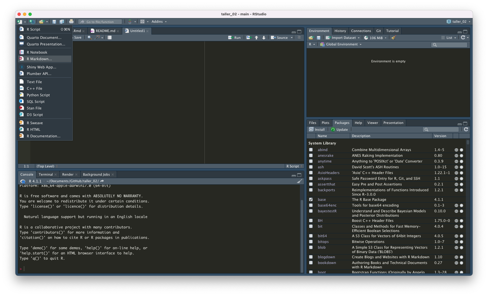
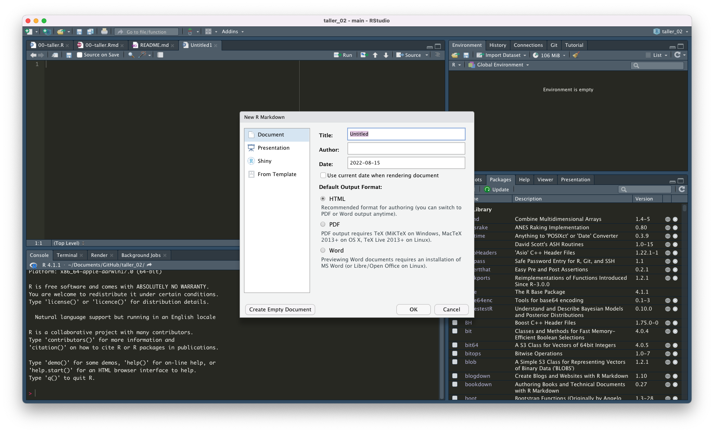

## R Markdown

En el primer taller, lo que hicimos fue abrir un script y trabajar en él. Para escribir un comentario o título en un script, se debe anteponer un `#` en la línea de código. Trabajar en un script es fácil, pero el trabajo en ellos puede ser confuso para alguien quien no está acostumbrado al lenguaje utilizado en R. Entonces, si queremos que nuestros trabajos sean reproducibles y accesibles, tenemos que pensar en otra forma de mostrar nuestra "área de trabajo". Por otro lado, R Markdown es utilizado también en el desarrollo de **blogs** o **páginas estáticas** en GitHub. Por ese motivo, en este curso de ahora en adelante utilizaremos este formato para avanzar en nuestro trabajo. 

Entonces, podemos utilizar R Markdown para:

* Guardar y ejecutar nuestras líneas de código.
* Generar informes de alta calidad que pueden ser compartidos con más personas.
* R Markdown genera distintos tipos de documentos (html, pdf, Words, dashboards, latex, etc.).
* No sólo funciona con el lenguaje R, sino también con otros formatos de códigos como Python.

Si tenemos instalada la librería `rmarkdown`, crearemos un archivo que nos servirá para avanzar en el taller de hoy:



Empezaremos cargando la librería `tidyverse`:

```{r librerias, message = F, warning = FALSE}
library(tidyverse)
```

Opciones que se pueden utilizar en los chunks:

```{r tabla_opciones, message=FALSE, warning=FALSE}
# Si queremos comentar un chunk, debemos tratarlo como un script y anteponer un gato

# Aunque el desarrollo o presentación de tablas aun no está en nuestro itinerario del curso, sí podemos empezar a instalar algunas de las librerías que nos servirán más adelante:

library(knitr)
library(kableExtra)

readxl::read_excel("input/tablas.xlsx") %>% 
  kable() %>% 
  kable_styling(bootstrap_options = c("striped", "hover", "condensed"))
```

***

## `tidyverse` & `ggplot2`

`ggplot2` es una librería dentro del `tidyvere` que nos permitirá hacer gráficos personalizables. Está basada en **The Grammar of Graphics** que propone un trabajo gramatical que puede ser usado para describir y construir una variedad amplia de gráficos estadísticos (para más información: ver *A Layered Grammar of Graphics* de Hadley Wickham (2010) y *The Grammar of Graphics* de Wilkinson, Anand y Grossman (2005)). Para que nos hagamos una idea: hacer gráficos requiere de que nosotros/as podamos ir separando cada pieza que lo compone: desde los tipos de variables que estamos utilizando hasta el tipo de letra que debe tener nuestro título. De esa manera, `ggplot2` se combierte en una herramienta valiosa para la presentación de resultados.

Las herramientas del `tidyverse` como lo son `filter()`, `mutate()`, `summarise()` y `arrange()` son útiles para transformar los datos que necesitaremos graficar. En algunos casos, esta será mínima, en otras tendremos que trabajar para llegar a una base de datos lista para graficar. Algo muy importante es saber diferenciar las bases de datos que son "anchas" de las que son "largas", porque dependiendo de su caracterización es cómo tendremos que jugar con ellas. Para ese tipo de transformaciones utilizamos `pivot_longer()` y `pivot_wider()`.

Cargaremos algunas bases de datos que están en la carpeta data:

```{r pressure, warning=F, message=F}
df_militantes <- readxl::read_excel("data/Estadistica por rango etario año 2016.xlsx")

names(df_militantes)

# Si ven la base de datos normal, verán que la primera fila no contiene los nombres de las variables. Por lo tanto, tenemos que cargarla especificando esto:

df_militantes <- readxl::read_excel("data/Estadistica por rango etario año 2016.xlsx", skip = 1)

names(df_militantes)

# Si contiene los nombres de las columnas. En R existe el paquete janitor que nos ayuda a limpiar los nombres de las columnas. Los nombres con caracteres especiales siempre dan problemas.

df_militantes <- df_militantes %>% 
  janitor::clean_names()

names(df_militantes)

# Ahora será más fácil escribir las variables.
```

Ahora, tenemos una base que podemos utilizar más fácilmente para codificar.

***

# Exploración de la base de datos

Uno de los primeros pasos siempre es explorar la base de datos. Para eso, tenemos distintas funciones. La función más básica es `head()` y `tail()`que nos permite ver la información de los primeros y últimas 10 filas de la base de datos. Después, tenemos `str()` que nos muestra el formato de las variables.

Pero ¿de qué hablamos cuando hablamos de los formatos de las variables?

Conocer en qué formato están nuestras variables nos hace la vida más fácil, porque nos permite utilizar funciones de acuerdo a su formato, especialmente cuando utilizamos el `tidyverse`.

```{r tabla_formatos}
readxl::read_excel("input/tablas.xlsx", sheet = "tabla_formatos") %>% 
  knitr::kable() %>% 
  kable_styling(bootstrap_options = c("striped")) %>% 
  column_spec(1, width_min = "3cm", bold = T) %>% 
  column_spec(2, width_min = "6cm") %>% 
  column_spec(3, width_min = "3cm")  
```

La función más básica para revisar las columnas es `str()`

```{r}
str(df_militantes)
```

Pero no es la única función:

```{r}
#Es la misma información, pero más ordenada:

glimpse(df_militantes)
```

Luego, tenemos `summary()` que nos permite tener el mínimo, máximo y los cuartiles de las variables. Especialmente útil cuando tenemos variables numéricas.

```{r}
summary(df_militantes)
```

Si necesitamos más información, tenemos `skim()`, que no sólo nos entrega información sobre las variables numéricas, sino también de las variables categóricas. Esta función viene del paquete `skimr`.

```{r}
skimr::skim(df_militantes)
```

Finalmente, podemos usar una función que creará un documento-reporte html con información básica de las variables como estructura, estadísticas, missings, visualizaciones sobre la distribución. Es la función `create_report()` del paquete `DataExplorer`. Se demorará unos segundos en hacer el reporte.

```{r include = F}
DataExplorer::create_report(df_militantes)
```

Como podemos observar ¡incluso nos entrega información de los componentes principales!

> Análisis de componentes principales exploratorio: Cuando hay muchas variables, lo normal es que estén relacionadas o que midan lo mismo bajo distintos parámetros (esto es muy importante, especialmente cuando creamos preguntas o parrillas para una encuesta). Por lo tanto, se hace necesario **reducir el número de variables**. En este caso, cuando las variables están fuertemente correlacionadas, estas puedes ser transformadas en nuevas variables llamado **conjunto de componentes principales**.

En este caso, las variables no tienen mucha información y están correlacionadas porque están midiendo básicamente lo mismo: el número de militantes por edad y género. Ya que tenemos nuestra descripción de los datos, volvamos al punto inicial. 

***

# Wide vs. long data

La base de datos que tenemos está en formato "wide", ¿qué quiere decir esto? Las edades, por ejemplo, están midiendo lo mismo. Para hacer un mayor análisis, necesitamos convertir nuestra base "wide" en una base "long". Esto es conocido como transformar una base "desordenada" en una base "tidy" u ordenada. Este último tipo nos sirve especialmente cuando usamos el tidyverse

¿Cómo hacemos esta tranformación?

```{r}
# Usamos pivot_longer()

df_militantes <- df_militantes %>% 
  pivot_longer(cols = starts_with("x"), names_to = "edad", values_to = "militantes")

head(df_militantes)
```

Ahora, revisemos la base de datos con `summary()`:

```{r}
summary(df_militantes)
```

***

# Grammar of graphics

Ya exploramos nuestros datos y convertimos nuestra base de datos en una base tidy. Es momento de que hagamos nuestros gráficos. Para eso, debemos aprender cómo hacerlo en `ggplot2`. La dimensión o capa principal es denomina `layer` que es usada para crear los objetos en un gráfico. Se pueden usar una multiplicidad de capas que usan los mismos datos. 

```{r tabla_graficos}
options(knitr.kable.NA = '')

readxl::read_excel("input/tablas.xlsx", sheet = "tabla_graficos") %>% 
  knitr::kable() %>% 
  kable_styling(bootstrap_options = c("striped")) %>% 
  column_spec(1, width_min = "3cm", bold = T) %>% 
  column_spec(3, width_min = "6cm") %>% 
  pack_rows("Layer", 1, 5)
```

Ahora, desarrollemos un ejemplo visual:

## 1. Primero, crearemos el objeto:

```{r}
p <- ggplot(df_militantes, aes(x = militantes, y = edad))
```

## 2. Agregamos el `geom` y definir el `stat`

Luego, tenemos que definir qué tipo de gráfico queremos. En este caso, haremos un gráfico de barras:

```{r}
p + 
  geom_bar(stat = "identity") # Contará el número de filas 
```

Hay ciertas cosas que debemos cambiar, por ejemplo:

* Cambiar cómo salen representados los rangos etarios.
* Cambiar la nomenclatura del eje x.

## 3. Escalas

Controla cómo los datos son representados. En este caso, ya tenemos definido cómo están dispuesto los ejes, pero quizás queremos obtener más información. Podemos agregar la variable "sexo" y esto será representado con distintos colores.

```{r}
p <- ggplot(df_militantes, aes(x = militantes, y = edad, fill = sexo))
```

```{r}
p + 
  geom_bar(stat = "identity")
```

## 4. Posición

Esto no es exactamente lo que queremos. Las barras apiladas no son útiles para ver el conteo de los casos.

```{r}
p + 
  geom_bar(stat = "identity", position = "dodge")
```

Podemos ver que además cambia la nomenclatura del eje x, ya que disminuimos el número de militantes por rango etario.

## 5. Sistema de coordenadas

El sistema de coordenadas no suele cambiar cuando trabajamos con este tipo de datos. Aun así, a veces lo usamos para dar "vuelta" la posición de los ejes.

```{r}
p + 
  geom_bar(stat = "identity", position = "dodge") +
  coord_flip()
```

## 6. Faceting

Puede que no nos guste como está visualizado el gráfico y queremos separar los hombres de las mujeres. Para eso usamos `facet`.

```{r}
p + 
  geom_bar(stat = "identity", position = "dodge") +
  facet_wrap(facets = vars(sexo))
```

## 7. Leyendas, títulos y tema

Como les iba diciendo, uno puede mejorar los gráficos ocupando títulos, mejorando las categorías de los datos y el tema. Este último, se refiere a todas esas cuestiones "estéticas" del gráfico.

```{r}
p + 
  geom_bar(stat = "identity", position = "dodge") +
  facet_wrap(facets = vars(sexo)) +
  labs(title = "Número de militantes de partidos políticos por género", subtitle = "Año 2016",
       x = "Número de militantes", y = "Rangos etarios", caption = "Fuente: SERVEL.") +
  theme_minimal()
```

Para cambiar los rangos etarios, necesitamos cambiar la base de datos con la que estamos trabajando.

```{r}

# Primero, veamos qué tipo de columna es "edad":

str(df_militantes)

# Con esto en consideración, hacemos la transformación. Se recomienda crear una nueva variable:

df_militantes <- df_militantes %>% 
  mutate(rangos_etarios = str_remove(edad, "x"))

head(df_militantes)

# Ya eliminamos la x, ahora podemos cambiar el guión bajo por un guión:

df_militantes <- df_militantes %>% 
  mutate(rangos_etarios = str_remove(edad, "x"),
         rangos_etarios = str_replace(rangos_etarios, "_", "-"))

head(df_militantes)

```

Volvemos al gráfico:

```{r}

# Tenemos que crear nuevamente el objeto para que capte las transformaciones que realizamos:

p <- ggplot(df_militantes, aes(x = militantes, y = rangos_etarios, fill = sexo))

p + 
  geom_bar(stat = "identity", position = "dodge") +
  facet_wrap(facets = vars(sexo)) +
  labs(title = "Número de militantes de partidos políticos por género", subtitle = "Año 2016",
       x = "Número de militantes", y = "Rangos etarios", caption = "Fuente: SERVEL.") +
  theme_minimal()
```

Otra cosa que podemos hacer es eliminar leyenda, ya que no aporta información. También, cambiaremos los títulos de los facets para que digan claramente "Mujeres" y "Varones".

```{r}
p +  
  geom_bar(stat = "identity", position = "dodge") +
  facet_wrap(facets = vars(sexo)) +
  labs(title = "Número de militantes de partidos políticos por género", subtitle = "Año 2016",
       x = "Número de militantes", y = "Rangos etarios", caption = "Fuente: SERVEL.") +
  guides(fill = "none") + # Tenemos que poner la escala que estamos usando para mostrar la variable sexo
  theme_minimal()
```

Cambiamos los títulos de los facets. Dependiendo de nuestros datos, podemos hacerlo directamente en el gráfico o renombrando las variables en la base de datos.

Primera opción:

```{r}

df_militantes_s <- df_militantes %>% 
  mutate(sexo = str_replace_all(sexo, c("M" = "Mujeres", "V" = "Varones")))

m <- ggplot(df_militantes_s, aes(x = militantes, y = rangos_etarios, fill = sexo))

m +  
  geom_bar(stat = "identity", position = "dodge") +
  facet_wrap(facets = vars(sexo)) +
  labs(title = "Número de militantes de partidos políticos por género", subtitle = "Año 2016",
       x = "Número de militantes", y = "Rangos etarios", caption = "Fuente: SERVEL.") +
  guides(fill = "none") + 
  theme_minimal()
```

Segunda opción:

```{r}
p +  
  geom_bar(stat = "identity", position = "dodge") +
  facet_grid(cols = vars(sexo),
             labeller = as_labeller(c('M' = "Mujeres", 'V' = "Varones"))) +
  labs(title = "Número de militantes de partidos políticos por género", subtitle = "Año 2016",
       x = "Número de militantes", y = "Rangos etarios", caption = "Fuente: SERVEL.") +
  guides(fill = "none") + 
  theme_minimal()
```

También podemos hacer ajustes al tema que estamos usando:

```{r}
p +  
  geom_bar(stat = "identity", position = "dodge") +
  facet_grid(cols = vars(sexo),
             labeller = as_labeller(c('M' = "Mujeres", 'V' = "Varones"))) +
  labs(title = "Número de militantes de partidos políticos por género", subtitle = "Año 2016",
       x = "Número de militantes", y = "Rangos etarios", caption = "Fuente: SERVEL.") +
  guides(fill = "none") + 
  theme_minimal() +
  theme(text = element_text(family = "Roboto Condensed"), # Existe el tema theme_roboto en el paquete hrbrthemes.
        title = element_text(face = "bold")) 
```

Cambiaremos los colores:

```{r}
p +  
  geom_bar(stat = "identity", position = "dodge") +
  scale_fill_manual(values = c("#d90429","#2b2d42")) +
  facet_grid(cols = vars(sexo),
             labeller = as_labeller(c('M' = "Mujeres", 'V' = "Varones"))) +
  labs(title = "Número de militantes de partidos políticos por género", subtitle = "Año 2016",
       x = "Número de militantes", y = "Rangos etarios", caption = "Fuente: SERVEL.") +
  guides(fill = "none") + 
  theme_minimal() +
  theme(text = element_text(family = "Roboto Condensed"), # Existe el tema theme_roboto en el paquete hrbrthemes.
        plot.title = element_text(face = "bold"),
        strip.text = element_text(colour = "#ef233c", face = "bold"),
        strip.background = element_rect(fill = "#edf2f4", colour = F)) 
```

Podemos hacer nuestro tema, que será utilizado en el resto de los gráficos. 

¿Qué graficaremos ahora?

Aquellos gráficos que nos permitirán observar la información de variables continuas.

Fuentes: 

* [R Markdown Website](http://rmarkdown.rstudio.com).
* [Create awesome html table with `knitr::kable` and `kableExtra`](https://cran.r-project.org/web/packages/kableExtra/vignettes/awesome_table_in_html.html).
* [Explore your dataset in R](https://www.r-bloggers.com/2018/11/explore-your-dataset-in-r/).
* [Grammar of graphics](https://cfss.uchicago.edu/notes/grammar-of-graphics/).
* [Paletas de colores](https://coolors.co/palettes/trending).
* [Especificaciones de temas](http://www.sthda.com/english/wiki/ggplot2-themes-and-background-colors-the-3-elements).