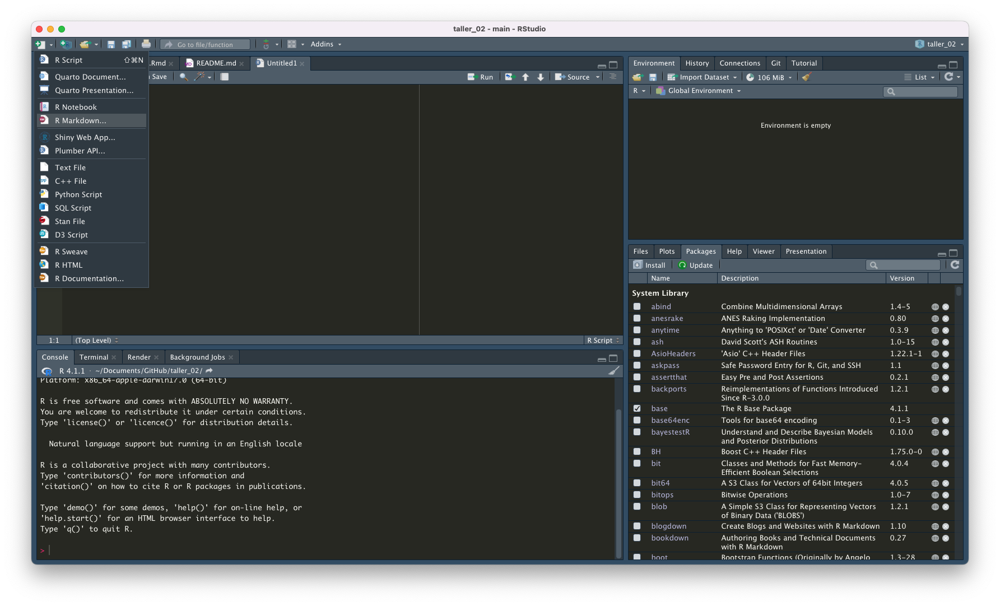
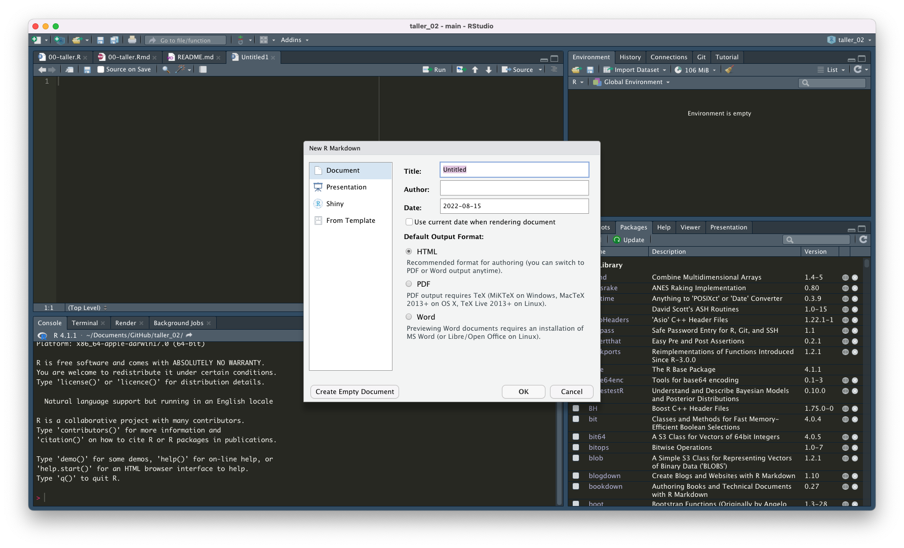

## R Markdown

En el primer taller, lo que hicimos fue abrir un script y trabajar en él. Para escribir un comentario o título en un script, se debe anteponer un `#` en la línea de código. Trabajar en un script es fácil, pero el trabajo en ellos puede ser confuso para alguien quien no está acostumbrado al lenguaje utilizado en R. Entonces, si queremos que nuestros trabajos sean reproducibles y accesibles, tenemos que pensar en otra forma de mostrar nuestra "área de trabajo". Por otro lado, R Markdown es utilizado también en el desarrollo de **blogs** o **páginas estáticas** en GitHub. Por ese motivo, en este curso de ahora en adelante utilizaremos este formato para avanzar en nuestro trabajo. 

Entonces, podemos utilizar R Markdown para:

* Guardar y ejecutar nuestras líneas de código.
* Generar informes de alta calidad que pueden ser compartidos con más personas.
* R Markdown genera distintos tipos de documentos (html, pdf, Words, dashboards, latex, etc.).
* No sólo funciona con el lenguaje R, sino también con otros formatos de códigos como Python.

Si tenemos instalada la librería `rmarkdown`, crearemos un archivo que nos servirá para avanzar en el taller de hoy:




Opciones que se pueden utilizar en los chunks:

```{r tabla_opciones, message=FALSE, warning=FALSE}
# Si queremos comentar un chunk, debemos tratarlo como un script y anteponer un gato

# Aunque el desarrollo o presentación de tablas aun no está en nuestro itinerario del curso, sí podemos empezar a instalar algunas de las librerías que nos servirán más adelante:

library(knitr)
library(kableExtra)

readxl::read_excel("tablas.xlsx") %>% 
  kable() %>% 
  kable_styling(bootstrap_options = c("striped", "hover", "condensed"))
```

***

Ok, sabemos cómo crear un documento `R Markdown` y, por lo que podemos observar, también podemos utilizar tablas. 

Ahora, conoceremos más funciones y utilidades del formato.

***

### Elementos

Diferentes herramientas y trucos que pueden ser usados para personalizar un documento R Markdown.

#### 


***

Recursos electrónicos:

* [R Markdown Website](http://rmarkdown.rstudio.com).
* [R Markdown Cookbook](https://bookdown.org/yihui/rmarkdown-cookbook/).
* [Create awesome html table with `knitr::kable` and `kableExtra`](https://cran.r-project.org/web/packages/kableExtra/vignettes/awesome_table_in_html.html).
* [Explore your dataset in R](https://www.r-bloggers.com/2018/11/explore-your-dataset-in-r/).
* [Grammar of graphics](https://cfss.uchicago.edu/notes/grammar-of-graphics/).
* [Paletas de colores](https://coolors.co/palettes/trending).
* [Especificaciones de temas](http://www.sthda.com/english/wiki/ggplot2-themes-and-background-colors-the-3-elements).

Bibliografía:

* Xie, Yihui, J. J. Allaire, and Garrett Grolemund. 2018. R Markdown: The Definitive Guide. Boca Raton, Florida: Chapman; Hall/CRC. https://bookdown.org/yihui/rmarkdown.